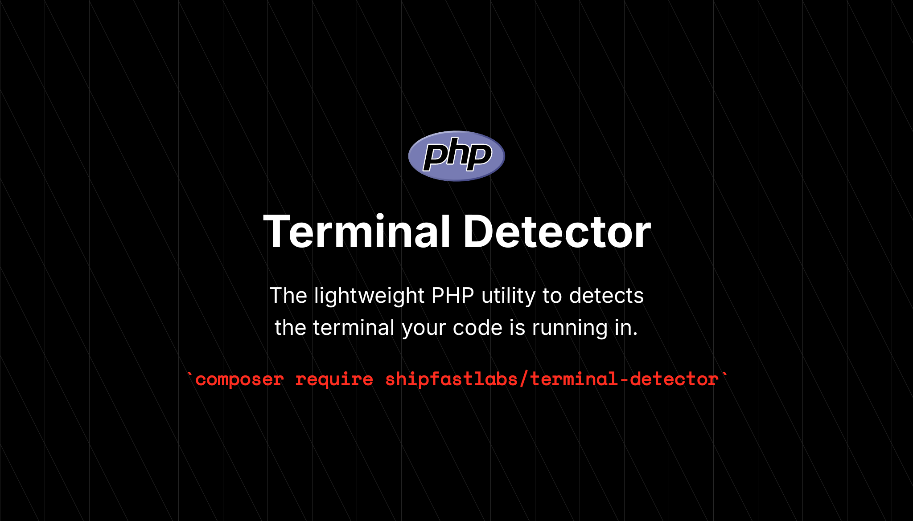

<p align="center">
    
    <p align="center">
        <a href="https://github.com/shipfastlabs/terminal-detector/actions"></a>
        <a href="https://packagist.org/packages/shipfastlabs/terminal-detector"></a>
        <a href="https://packagist.org/packages/shipfastlabs/terminal-detector"></a>
        <a href="https://packagist.org/packages/shipfastlabs/terminal-detector"></a>
    </p>
</p>

# Terminal Detector

Detects which terminal emulator is running the current PHP process.

> **Requires [PHP 8.2+](https://php.net/releases/)**

## Installation

```bash
composer require shipfastlabs/terminal-detector
```

## Usage

```php
use TerminalDetector\TerminalDetector;

$result = TerminalDetector::detect();

if ($result->detected) {
    echo "Running inside: {$result->name}";
}

// Check for a specific known terminal
if ($result->knownTerminal() === \TerminalDetector\KnownTerminal::Ghostty) {
    echo "Hello from Ghostty!";
}
```

Or use the standalone function:

```php
use function TerminalDetector\detectTerminal;

$result = detectTerminal();
```

### Result Properties

```php
$result->detected;        // true / false
$result->name;            // e.g. 'iterm2', 'ghostty', 'vscode'
$result->version;         // e.g. '3.5.0' (from TERM_PROGRAM_VERSION)
$result->knownTerminal(); // KnownTerminal enum or null
```

## Known Terminals

The `KnownTerminal` enum provides type-safe identifiers for all supported terminals:

| Enum Case | Value |
|---|---|
| `KnownTerminal::ITerm2` | `iterm2` |
| `KnownTerminal::AppleTerminal` | `apple-terminal` |
| `KnownTerminal::VSCode` | `vscode` |
| `KnownTerminal::Hyper` | `hyper` |
| `KnownTerminal::WarpTerminal` | `warp` |
| `KnownTerminal::WezTerm` | `wezterm` |
| `KnownTerminal::Kitty` | `kitty` |
| `KnownTerminal::Alacritty` | `alacritty` |
| `KnownTerminal::Ghostty` | `ghostty` |
| `KnownTerminal::WindowsTerminal` | `windows-terminal` |
| `KnownTerminal::JetBrains` | `jetbrains` |
| `KnownTerminal::Konsole` | `konsole` |
| `KnownTerminal::GnomeTerminal` | `gnome-terminal` |
| `KnownTerminal::Tilix` | `tilix` |
| `KnownTerminal::Tabby` | `tabby` |
| `KnownTerminal::Rio` | `rio` |
| `KnownTerminal::Tmux` | `tmux` |
| `KnownTerminal::Zellij` | `zellij` |
| `KnownTerminal::Screen` | `screen` |
| `KnownTerminal::SSHSession` | `ssh` |
| `KnownTerminal::Xterm` | `xterm` |

## Supported Terminals

| Terminal | Detection Method |
|---|---|
| iTerm2 | `TERM_PROGRAM` |
| Apple Terminal | `TERM_PROGRAM` |
| VS Code | `TERM_PROGRAM` |
| Hyper | `TERM_PROGRAM` |
| Warp | `TERM_PROGRAM` |
| WezTerm | `TERM_PROGRAM` |
| Rio | `TERM_PROGRAM` |
| Kitty | `KITTY_WINDOW_ID` / `TERM` |
| Ghostty | `GHOSTTY_RESOURCES_DIR` / `TERM` |
| Windows Terminal | `WT_SESSION` |
| JetBrains | `TERMINAL_EMULATOR` |
| Konsole | `KONSOLE_DBUS_SESSION` / `KONSOLE_VERSION` |
| Tilix | `TILIX_ID` |
| GNOME Terminal | `GNOME_TERMINAL_SCREEN` / `VTE_VERSION` |
| Tabby | `TABBY_CONFIG_DIRECTORY` |
| Alacritty | `TERM` |
| Xterm | `TERM` |
| tmux | `TMUX` |
| Zellij | `ZELLIJ` |
| Screen | `STY` |
| SSH | `SSH_CONNECTION` / `SSH_CLIENT` |

## Custom Override

Set the `TERMINAL_DETECTOR` environment variable to force a specific terminal name:

```bash
TERMINAL_DETECTOR=my-terminal php script.php
```

## License

Terminal Detector is open-sourced software licensed under the **[MIT license](https://opensource.org/licenses/MIT)**.
